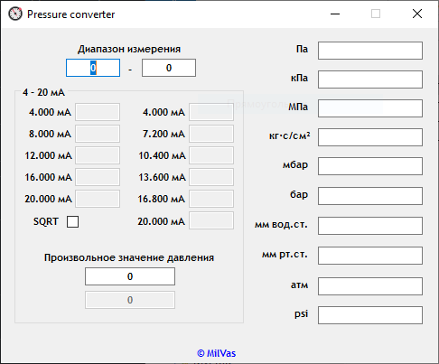

# Pressure Converter

## Описание проекта

**Pressure Converter** — это настольное приложение для Windows, разработанное на Visual Basic .NET с использованием .NET Framework 4.8. Приложение предназначено для инженеров, техников и специалистов в области измерительной техники, позволяя быстро конвертировать единицы давления и рассчитывать соответствующие значения тока для калибровки измерительных приборов.

## Функциональность

### Конвертация единиц давления
Приложение поддерживает конвертацию между 10 различными единицами измерения давления:
- Па (Паскали)
- кПа (килоПаскали)
- МПа (мегаПаскали)
- кгс/см² (килограмм-сила на квадратный сантиметр)
- мбар (миллибар)
- бар
- мм вод.ст. (миллиметр водяного столба)
- мм рт.ст. (миллиметр ртутного столба)
- атм (атмосфера)
- psi (фунт-сила на квадратный дюйм)

### Расчет тока (4-20 мА)
- Возможность ввода минимального и максимального значения давления
- Расчет соответствующего значения тока в мА для произвольного значения давления
- Поддержка двух режимов расчета:
  - Линейный (4-20 мА)
  - Квадратный корень (4-20 мА по квадратному корню) - включается чекбоксом SQRT

### Расчет точек калибровки
- Автоматический расчет 5 точек калибровки (0%, 25%, 50%, 75%, 100%)
- Автоматический расчет 6 точек калибровки (0%, 20%, 40%, 60%, 80%, 100%)
- Для каждой точки рассчитывается соответствующее значение тока в мА

### Поддержка отрицательных значений
- Возможность работы с отрицательными значениями давления
- Валидация ввода с поддержкой отрицательных чисел

## Технологии

- **Платформа**: Microsoft .NET Framework 4.8
- **Графический интерфейс**: Windows Forms
- **Язык программирования**: Visual Basic .NET
- **Система сборки**: MSBuild
- **Контроль версий**: Git

## Архитектура

- Использование матрицы коэффициентов преобразования для конвертации единиц давления
- Обработка событий для всех текстовых полей с использованием общих обработчиков
- Валидация ввода с ограничением на цифры, десятичный разделитель и отрицательные значения
- Флаг `isUpdating` для предотвращения циклических обновлений при конвертации
- Форматирование значений до 8 знаков после запятой

## Интерфейс

- Основное окно содержит поля для ввода значений давления в 10 единицах измерения
- Группа "4-20 мА" с полями для ввода диапазона и расчета тока
- Чекбокс для переключения между линейным и квадратным корневым законом преобразования
- Поля для отображения точек калибровки (5 и 6 точек) с соответствующими значениями тока
- Ссылка на веб-сайт разработчика (www.milvas.ru)

## Установка и запуск

Приложение распространяется в виде исполняемого файла (.exe), который можно запустить на любой системе с установленным .NET Framework 4.8 или выше.

## Автор

MilVas

